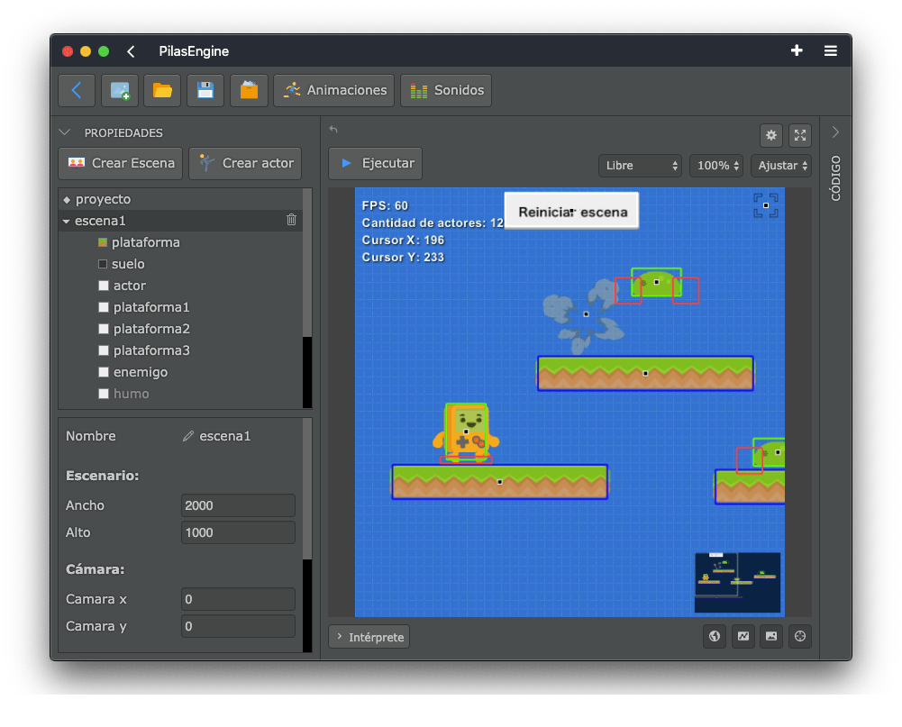

# Pilas Engine 2

[](https://circleci.com/gh/pilas-engine/pilas-engine)

Pilas es un motor para aprender a programar realizando videojuegos, visitá la
web para obtener más información:

- http://www.pilas-engine.com.ar



## Artículos y noticias

- [Resumen del sprint 27 (Agosto de 2021)](https://foro.pilas-engine.com.ar/t/resumen-del-sprint-27/2228)
- [Resumen del sprint 26 (Marzo del 2021)](https://foro.pilas-engine.com.ar/t/resumen-del-sprint-26/2170)
- [Resumen del sprint 25 (24 de Enero del 2021)](https://foro.pilas-engine.com.ar/t/resumen-del-sprint-25/2144)
- [Resumen del sprint 24 (15 de Noviembre del 2020)](https://foro.pilas-engine.com.ar/t/resumen-del-sprint-24/2066)
- [Resumen del sprint 23 (27 de Septiembre del 2020)](https://foro.pilas-engine.com.ar/t/resumen-del-sprint-23/2034)
- [Resumen del sprint 22 (6 de Septiembre del 2020)](https://foro.pilas-engine.com.ar/t/resumen-del-sprint-22/2006)
- [Resumen del sprint 21 (1 de Agosto del 2020)](https://foro.pilas-engine.com.ar/t/resumen-del-sprint-21/1984)
- [Resumen del sprint 20 (12 de Julio del 2020)](https://foro.pilas-engine.com.ar/t/resumen-del-sprint-20/1975)
- [Resumen del sprint 19 (27 de Junio del 2020)](https://foro.pilas-engine.com.ar/t/resumen-del-sprint-19/1932)
- [Resumen del sprint 18 (6 de Junio del 2020)](https://foro.pilas-engine.com.ar/t/resumen-del-sprint-18/1907)
- [Resumen del sprint 17 (23 de Mayo de 2020)](https://foro.pilas-engine.com.ar/t/resumen-del-sprint-17/1876)
- [Resumen del sprint 16 (11 de Mayo de 2020)](https://foro.pilas-engine.com.ar/t/resumen-del-sprint-16/1862)
- [Resumen del sprint 15 (26 de Abril de 2020)](https://foro.pilas-engine.com.ar/t/resumen-del-sprint-15)
- [Resumen del sprint 14 (5 de Abril de 2020)](https://foro.pilas-engine.com.ar/t/resumen-del-sprint-14/1829)
- [Resumen del sprint 13 (18 de Enero de 2020](https://foro.pilas-engine.com.ar/t/resumen-del-sprint-13/1807/2)
- [Resumen del sprint 12 (21 de Diciembre de 2019)](https://foro.pilas-engine.com.ar/t/resumen-del-sprint-12/1802)
- [Resumen del sprint 11 (16 de Octubre de 2019)](https://foro.pilas-engine.com.ar/t/resumen-del-sprint-11/1745)
- [Resumen del sprint 10 (31 de Julio de 2019)](https://foro.pilas-engine.com.ar/t/resumen-del-sprint-10/1702)
- [Resumen del sprint 9 (11 de Julio de 2019)](https://foro.pilas-engine.com.ar/t/resumen-del-sprint-09/1688)
- [Resumen del sprint 8 (9 de Junio de 2019)](http://foro.pilas-engine.com.ar/t/resumen-del-sprint-08/1669)
- [Resumen del sprint 7 (18 de Mayo de 2019)](http://foro.pilas-engine.com.ar/t/resumen-del-sprint-07/1656)
- [Resumen del sprint 6 (27 de Abril de 2019)](http://foro.pilas-engine.com.ar/t/resumen-del-sprint-06/1648)
- [Resumen del sprint 5 (1 de Diciembre de 2018)](http://foro.pilas-engine.com.ar/t/resumen-del-sprint-05/1592)
- [Resumen del sprint 4 (5 de Junio de 2018)](http://foro.pilas-engine.com.ar/t/resumen-del-sprint-04/1401)
- [Resumen del sprint 3 (28 de Abril del 2018)](http://foro.pilas-engine.com.ar/t/resumen-del-sprint-03/1389)
- [Resumen del sprint 2 (31 de Marzo del 2018)](http://foro.pilas-engine.com.ar/t/resumen-del-sprint-02/1375)
- [Resumen del sprint 1 (20 de Marzo del 2018)](http://foro.pilas-engine.com.ar/t/resumen-del-sprint-01/1366)
- [Anuncio del comienzo de pilas 2](https://www.examplelab.com.ar/posts/2018-03-04-comenzamos-pilas-engine-2/)

## Links útiles

- http://app.pilas-engine.com.ar - La versión más reciente de pilas.
- http://pilas-engine.surge.sh - La versión más reciente de pilas (mirror).
- http://manual-pilas-engine.surge.sh - El manual actualizado al día de la fecha.
- https://circleci.com/gh/pilas-engine/pilas-engine - El resultado de los tests de integración.
- http://foro.pilas-engine.com.ar - El foro donde debatimos ideas y anunciamos las versiones nuevas.
- https://github.com/pilas-engine/pilas-engine/releases - Las versiones descargables de Pilas offline y los manuales.

## Primeros pasos

Antes de comenzar, te recomendamos tener en cuenta este video en donde
explicamos cómo crear el entorno de pilas-engine y hacer algunas tareas
básicas: https://www.youtube.com/watch?v=ASKYT7OoLos

También vas a encontrar instrucciones para colaborar
aquí: http://manual-pilas-engine.surge.sh/entorno.html

Para comenzar a utilizar este repositorio deberías tener instalado git, 
Make, nodejs (versión 6 o superior) y ejecutar estos comandos:

```
git clone https://github.com/pilas-engine/pilas-engine.git
cd pilas-engine
make iniciar
```

El comando `make iniciar` va a instalar todas las dependencias que se
necesitan para compilar y ejecutar el proyecto. Este proceso puede tardar
unos minutos en completarse.

Una vez que termine, con el comando `make` van a aparecer en pantalla
los comandos típicos a la hora de utilizar el proyecto.

## Estilo de programación

Si estás con ganas de participar del proyecto o enviar correcciones, ten
en cuenta que el código enviado debería estar en español (siempre que sea
posible) y que las variables o métodos con varias palabras tienen que estar
separadas por guiones bajos (por ejemplo "cantidad_de_actores")

Además, es muy importante que tengas configurado tu editor para usar
automáticamente Prettier (https://prettier.io/).

## Créditos

Este proyecto es posible gracias a la comunidad de pilas-engine, y a la
existencia de varias herramientas y bibliotecas como:

- https://phaser.io/
- https://github.com/jdotrjs/phaser3-nineslice/
- https://electronjs.org/
- https://developers.google.com/blockly
- https://github.com/koffsyrup/FileSaver.js
- https://github.com/lukeed/polka
- https://github.com/lukeed/sirv
- https://github.com/flyover/spriter.ts
- https://github.com/nathancahill/split/tree/master/packages/splitjs
- https://www.zondicons.com/
- https://stuk.github.io/jszip/

## Próximas tareas a desarrollar

Las próximas tareas siempre se describen en el foro de pilas, y
en los resúmenes de sprint. Te recomiendo ver el más reciente
en la sección ["Artículos y noticias"](https://github.com/pilas-engine/pilas-engine#art%C3%ADculos-y-noticias)
de este mismo archivo.
