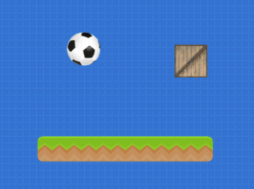
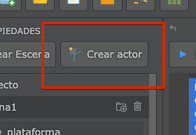
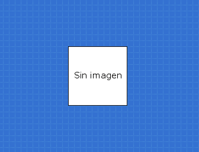
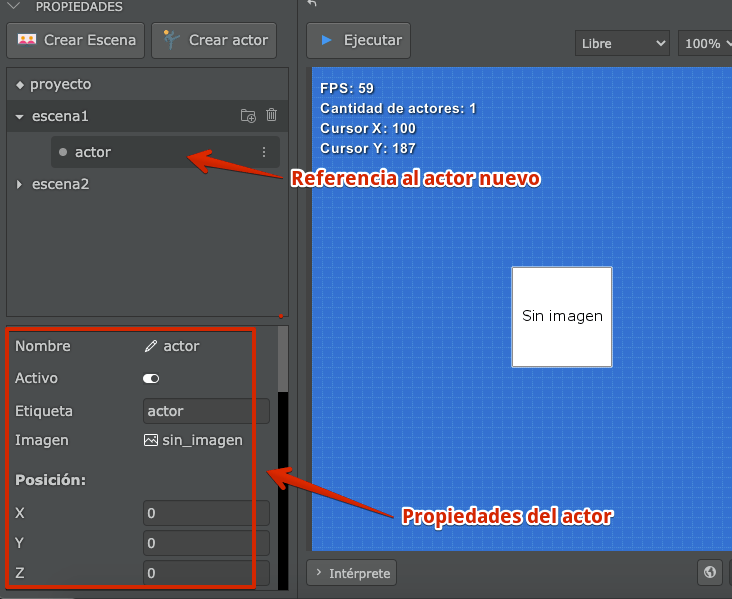
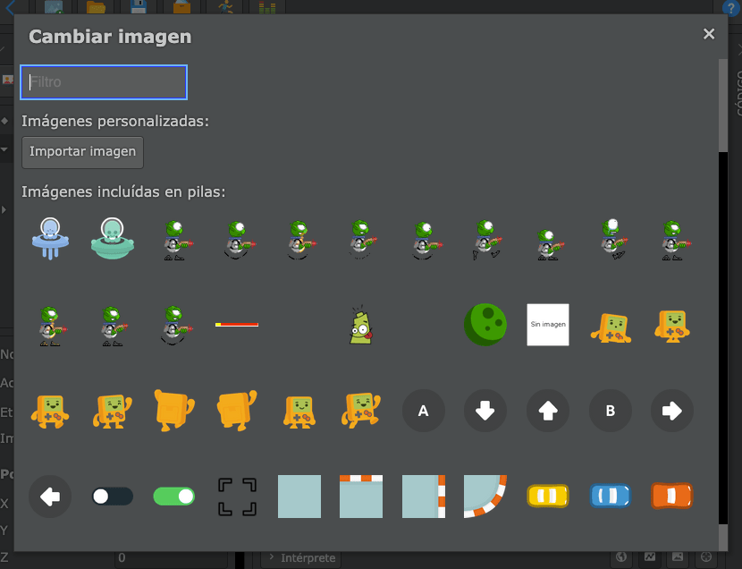
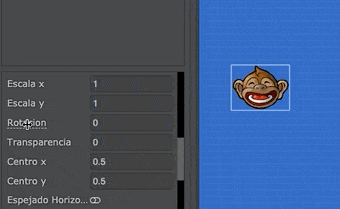

En pilas llamamos "actores" a los objetos que aparecen en la pantalla y pueden
interactuar con el escenario. 

Cuando abrís pilas por primera vez vas a notar que en la pantalla hay tres
actores principales, cada uno de estos actores tiene una imagen, posición y
comportamiento diferente:



Sin embargo, lo más interesante de estos actores es que los podemos
personalizar tanto como queramos, podemos hacer que reaccionen al teclado, que
se muevan por si solos, que emitan sonidos o tengan diferentes apariencias.

## Cómo crear un actor nuevo

Para crear un actor simplemente hay que pulsar el botón "crear actor" del
editor:



Y ahí se va a desplegar una ventana con varios actores pre diseñados para
incluir en tu juego:


Cada uno de estos actores viene con algún comportamiento para que puedas
experimentar e investigar. Ten en cuenta que cada actor que agregues se va a
poder cambiar por completo.

## Un actor básico

Si bien pilas trae varios actores completos, cada juego es diferente y único,
así que el actor mas conveniente para todo juego es un actor mínimo que podemos
personalizar desde cero.

Este actor aparece como un rectángulo blanco que dice "sin imagen":


Ahora si bien es el actor más discreto de todos, lo vamos usar para hacer
algunas pruebas y mostrarte conceptos de la herramienta.

Pulsa el botón "crear actor" y luego selecciona a este actor de modo que te
quede en la escena de esta forma (los otros actores los podes eliminar por el
momento):



A partir de ese momento, el actor formará parte de la escena, así que vas a ver
su nombre en el panel de la escena y una serie de propiedades en el panel
izquierdo:



Sentite libre de cambiar esas propiedades para experimentar cómo se puede
personalizar a un actor. 

La propiedad más utilizada es `imagen`, que cuando la pulses te va a dar una
serie imágenes alternativas para seleccionar:



Por ejemplo, si elijo la imagen del mono sonriendo mi actor va a tener una
apariencia completamente diferente:


Todas las propiedades se pueden ajustar usando el teclado o incluso realizando
movimientos con el mouse:




## Recortar imágenes de actores

Si estás buscando crear efectos o juegos de piezas, ten en cuenta que existe un
método llamado `recortar` que te permite seleccionar una porción de la imagen
del actor y mostrarla en pantalla.

Por ejemplo, si tenemos un actor como este:


Podemos crear un recorte a la mitad mediante este código:

```typescript
this.recortar(0, 0, 125, 146);
```


Donde los valores `0, 0, 125, 146` son las coordenadas `izquierda`, `arriba`,
`ancho` y `alto` :


y cuando quieras volver a la imagen original, simplemente puede llamar a la
función:

```typescript
this.eliminar_recortado();
```

