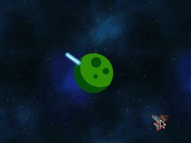

Pilas trae varias funciones para realizar cálculos geométricos sencillos, como
obtener la distancia entre actores o incluso el ángulo entre ellos.

## Ángulo entre actores o puntos

Un ejemplo práctico sería poder mirar en dirección a donde está el
puntero del mouse: Observa uno de los ejemplos que trae pilas, el usuario
puede mover el puntero del mouse y observar cómo el cañon ajusta su rotación
correctamente:


Este ejemplo hace uso de la función `obtener_angulo_entre_puntos` así:

```typescript
let x = actor_cañon.x;
let y = actor_cañon.y;
let cx = pilas.cursor_x;
let cy = pilas.cursor_y;

actor_cañon.rotacion = pilas.obtener_angulo_entre_puntos(x, y, cx, cy);
```

La función `obtener_angulo_entre_puntos` espera que le enviemos 4 parámetros,
correspondientes a los dos puntos que nos interesan. El resutado de la función
es el ángulo en grados esperado.

También existe una función llamada `obtener_angulo_entre_actores`, que hace
algo muy similar, solamente que espera que le enviemos dos actores en lugar
de 4 números.

Un ejemplo que muestra esto es `angulo-entre-actores`, que nos muestra una
nave mirando constantemente al centro de la pantalla, donde está el actor
planeta:



Si observas el código, vas a encontrar una llamada a
`obtener_angulo_entre_actores` similar a la siguiente:

```typescript
let nave = pilas.actores.nave();
let planeta = pilas.obtener_actor_por_nombre("planeta");
nave.rotacion = pilas.obtener_angulo_entre_actores(nave, planeta);
```

## Distancia entre puntos y actores

Otras dos funciones útiles en esta categoría son las funciones
`obtener_distancia_entre_puntos` y `obtener_distancia_entre_actores`. Ambas
reciben los argumentos de manera muy similar a las funciones de ángulos
anteriores. Aquí unos ejemplos:

```typescript
let actor = pilas.actores.aceituna();
let cx = pilas.cursor_x;
let cy = pilas.cursor_y;

let distancia = pilas.obtener_distancia_entre_puntos(actor.x, actor.y, cx, cy);
actor.decir(`la distancia al mouse es ${distancia}`);
```

o entre actores:

```typescript
let actor = pilas.actores.aceituna();
actor.x = 100;

let nave = pilas.actores.nave();

let distancia = pilas.obtener_distancia_entre_actores(actor, nave);
nave.decir(`la distancia al otro actor es ${distancia}`);
```
