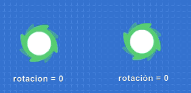
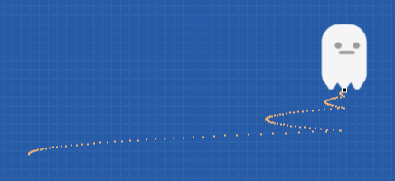

Todos los actores tienen una serie de propiedades como `x`, `y`, `rotacion` y `transparencia`. En
total hay mas de 10 propiedades listas para modificar, tanto desde el editor como desde el código.

Ahora bien, si cambiamos progresivamente estas propiedades podemos lograr animaciones interesantes.
Por ejemplo podríamos cambiar progresivamente la rotación de un actor para que parezca estar en
movimiento así:



Y lo mismo con las otras propiedades, si queremos que un actor se mueva hacia la derecha de la
pantalla podemos cambiar muchas veces su propiedad `x` para que parezca "moverse" hacia un costado
de la pantalla.

Sin embargo, hacer animaciones cambiando propiedades una a una se puede volver tedioso si realmente
queremos hacer animaciones completas, así que pilas tienen una forma de simplificar esto.

## Usando la función "animar"

Todos los actores tienen una función llamada `animar` parar facilitar la creación de animaciones, o movimientos, mediante el cambio de propiedades de un actor.

Si queremos lograr que un actor gire infinitas veces como mostramos en la animación de más arriba podemos escribir lo siguiente:


La función `this.animar` iniciará una animación sobre las propiedades del actor. Primero espera dos
argumentos:

- El tipo de animación que se realizará, esta puede ser `Tipo.lineal`, `Tipo.desborde`, `Tipo.suave`, `Tipo.elastico`, `Tipo.rebote`. Vamos a ver esto en la siguiente sección.
- La cantidad de veces que se ejecutará la animación: aquí se puede poner un número como 5 para que la animación de rotación se haga `5` veces, o como valor especial se puede colocar `-1` para que la animación se haga por siembre.

Lo siguiente que se coloca después de la llamada a `this.animar()` es una secuencia de animaciones
a realizar.

Por ejemplo, en este ejemplo se le pide al actor que se mueva a la derecha, gire 180 grados y luego
regrese al punto `(0, 0)` una vez:

```javascript
this.animar(Tipo.suave, 1)
  .rotar(180)
  .mover_x(200)
  .rotar(180)
  .mover_hasta(0, 0);
```


## Animaciones soportadas

Existen varias propiedades que se pueden animar, como la posición de los actores, la
rotación, transparencia etc...

Para ver el listado completo de estas animaciones te recomiendo mirar la ayuda
que te ofrece el editor justo después cerrar el paréntesis que inicia la animación:


Algunas animaciones esperan parámetros, como el valor esperado para la propiedad y la
duración total de la animación, así que nuevamente ten en cuenta que el editor
te ayudará a conocer los parámetros que espera cada una de las animaciones.

## Tipos de animaciones

El primer argumento de la función `this.animar` pude ser uno de estos:

- `Tipo.lineal`
- `Tipo.suave`
- `Tipo.desborde`
- `Tipo.rebote`
- `Tipo.elastico`

Ahora bien, ¿qué significan estos valores?, ¿En qué se diferencian?: Las animaciones
son básicamente transformaciones que se le hacen a las propiedades a través del
tiempo, así que estos tipos de animaciones se diferencian en cómo la animación
progresará en el tiempo.

Veamos el tipo de animación `Tipo.lineal` primero, que es uno de los más sencillos:

### Tipo.Lineal

Imagina que tenemos un actor y le pedimos hacer un movimiento en el eje `x` de forma lineal
con este código:

```javascript
this.animar(Tipo.lineal).mover_x(350);
```

Si dibujamos cómo se mueve un actor en el tiempo usando una animación de tipo `lineal` vamos
a ver que el movimiento se hace de forma constante, avanzando siempre a la misma velocidad:


¿Y cómo son el resto de las animaciones?.

### Tipo.Suave

La animación de tipo `suave` es similar a la lineal, pero hace que el actor se mueva con
cierta desaceleración:

```javascript
this.animar(Tipo.suave).mover_x(350);
```


Esto se puede notar porque los puntos por los que pasó el actor se ven cada vez más juntos.

### Tipo.desborde

La animación de tipo `desborde` superará el punto de llegada, pero retomará la posición
para corregir el desvío.

```javascript
this.animar(Tipo.desborde).mover_x(350);
```

Para que este gráfico se vea un poco mejor, se combinó con un movimiento vertical:


Observa como cerca del punto de llegada el personaje superó la coordenada 350, a
la que le habíamos pedido que se mueva, pero suavemente retomó para corregir el
desborde:


### Tipo.rebote

La animación de tipo rebote llegará al punto solicitado pero va a regresar y corregir
la posición varias veces:

```javascript
this.animar(Tipo.rebote).mover_x(350);
```



Es ideal para movimiento que aparenten ser mecánicos, como giros de engranajes o palancas.

### Tipo.elastico

Las animaciones elásticas son las más llamativas cuando se utilizan en movimientos
y rotaciones:

```javascript
this.animar(Tipo.elastico).mover_x(350);
```


Este tipo de animaciones también se ven muy bien cuando se aplican a escalas, por ejemplo
si quieres hacer que un actor parezca "esponjoso" podrías lograrlo combinando dos animaciones
así:

```javascript
this.escala_x = 0.6;
this.escala_y = 1.4;
this.animar(Tipo.elastico, 1, 5).escalar_x_hasta(1);
this.animar(Tipo.elastico, 1, 5).escalar_y_hasta(1);
```


## Comparando tipos de animaciones

Una forma de ayudarte a reconocer los tipos de animaciones es probar el
ejemplo "tipos de animación" de los ejemplos de pilas:


Sin embargo, mi recomendación es que pruebes qué tipo de animación funciona
mejor en el juego que estés haciendo, recuerda que cuando escribas el código el
propio editor te guiará por todas las opciones disponibles:


