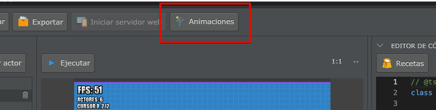
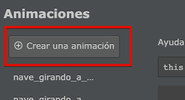

Para crear animaciones se tiene que utilizar el editor que aparece en la parte superior de la pantalla:



Este botón abrirá una ventana en donde se pueden previsualizar todas la animaciones del proyecto:


Estas animaciones también se pueden editar fácilmente, solo tienes que pasar el mouse sobre el nombre de la animación y pulsar el  botón "editar":


Las animaciones son simplemente una lista de imágenes que pilas mostrará una detrás de la otra, a determinada velocidad. Vas ver toda esta información en el editor de animaciones:


## Crear animaciones desde el editor

Para crear animaciones hay que pulsar el botón "Crear una animación":



y luego cargar cada uno de los cuadros de animación pulsando el botón "+" que aparece en la parte superior de la ventana:


Por ejemplo, aquí incluí algunos cuadros de animación de un personaje corriendo:


Podes utilizar el botón "Reproducir" y la propiedad "Cuadros por segundo" para ajustar la velocidad de la animación y dejarla como quieras:


Por último es muy importante que le asignes un nombre a la animación, por ejemplo "shaolin_corre":


Esto es muy importante porque tu juego puede tener un montón de animaciones, y el nombre que le asignes será la única forma de identificar cada una de las animaciones.

Ahora sí, podes cerrar la ventana del editor y continuar con la siguiente sección.

## Cómo usar las animaciones

Una vez que tienes creada la animación, lo único que hace falta es copiar el código que aparece como ayuda en el visor de animaciones dentro del código:


Ese código, sirve para indicarle al actor qué animación tiene que reproducir. Por ejemplo, si quieres que el actor muestre esta animación al comenzar deberías colocarlo dentro de la función "iniciar" así:


## Crear animaciones desde el código

Para crear y asignar animaciones también se puede usar directamente el código del editor. Esto es algo más difícil, pero en algunas situaciones puede ser útil.

Existe un método llamado "crear_animacion" que se puede invocar especificando el nombre de la animación, los cuadros que se deben mostrar y la velocidad.

Por ejemplo, para crear una animación de un actor mientras está esperando usé lo siguiente:

```typescript
this.crear_animacion("conejo_parado", ["imagenes:conejo/conejo_parado1", "imagenes:conejo/conejo_parado2"], 2);
```

El valor "2" significa que la animación se debe mostrar a una velocidad de 2 cuadros por segundo.

Luego, una vez creada la animación, se puede reproducir usando esta llamada:

```typescript
this.animacion = "conejo_parado";
```

La creación de animaciones generalmente se realiza en el método iniciar de esta forma:

```typescript
class Conejo extends Actor {
  iniciar() {
    this.crear_animacion("conejo_parado", ["imagenes:conejo/conejo_parado1", "imagenes:conejo/conejo_parado2"], 2);
    this.crear_animacion("conejo_camina", ["imagenes:conejo/conejo_camina1", "imagenes:conejo/conejo_camina2"], 20);
    this.crear_animacion("conejo_salta", ["imagenes:conejo/conejo_salta"], 20);
    this.crear_animacion("conejo_muere", ["imagenes:conejo/conejo_pierde"], 1);

    this.animacion = "conejo_parado";
  }

  actualizar() {}
}
```

Luego, para cambiar de animación, se puede re-definir el valor del atributo
animación así:

```typescript
class Conejo extends Actor {
  iniciar() {
    this.crear_animacion("conejo_parado", ["imagenes:conejo/conejo_parado1", "imagenes:conejo/conejo_parado2"], 2);
    this.crear_animacion("conejo_camina", ["imagenes:conejo/conejo_camina1", "imagenes:conejo/conejo_camina2"], 20);
    this.crear_animacion("conejo_salta", ["conejo_salta"], 20);
    this.crear_animacion("conejo_muere", ["conejo_muere"], 1);

    this.animacion = "conejo_parado";
  }

  actualizar() {
    if (this.pilas.control.izquierda) {
      this.animacion = "conejo_camina";
      this.x -= 5;
    }

    if (this.pilas.control.derecha) {
      this.animacion = "conejo_camina";
      this.x += 5;
    }

    if (!this.pilas.control.izquierda && !this.pilas.control.derecha) {
      this.animacion = "conejo_parado";
    }
  }
}
```

## Detectar la finalización de las animaciones

Las animaciones siempre se muestran de forma cíclica, es decir, cuanto terminan
vuelven a empezar desde cero. Si tu animación es tradicional, como un personaje
caminando, no tienes que hacer nada adicional para que continue la animación
automáticamente.

Si quieres detectar el momento exacto cuando la animación llega a su final,
deberías crear un método llamado `cuando_finaliza_animacion` y colocar ahí
algún código para reaccionar ante la finalización de la animación. Por ejemplo,
el actor "explosión" se elimina de la pantalla automáticamente cuando
finaliza su animación:

```typescript
class explosion extends Actor {

  // Otros métodos

  cuando_finaliza_animacion(nombre: string) {
    this.eliminar();
  }
}
```
