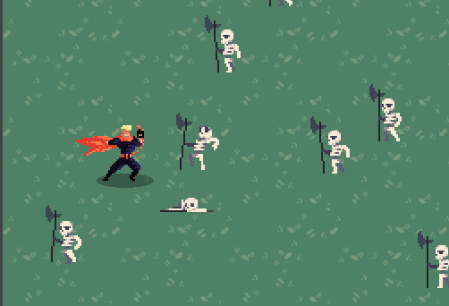

Un desafío muy común en el desarrollo de juegos es lograr que los actores puedan mostrar animaciones y reaccionar de acuerdo a modos particulares: saltar, caminar, quedarse parado, perdiendo, etc…

Para estas cosas Pilas incorpora un mecanismo de autómatas y estados.

Un actor puede estar en un estado a la vez, y solo se puede mover a otros estados a través de transiciones.

Por ejemplo, imaginemos un actor de un juego de plataformas que solo puede hacer dos cosas, saltar y quedarse parado en el lugar:


Si queremos llevar este personaje a un juego nos conviene tener una técnica para permitirle al usuario hacer cualquiera de esas dos acciones pero bajo determinadas condiciones. Solo podría saltar cuando está con los pies en el suelo (es decir, si está en estado "parado") y una vez que está saltando deja de hacerlo cuando toca el suelo:


A este tipo de gráficos lo llamamos diagrama de estados, o autómata, y si bien puede parece un simple modelo gráfico, lo cierto es que resulta muy útil a la hora de escribir el código en nuestro juego.

## Implementando estados en pilas

Siguiendo con nuestro ejemplo, el personaje tiene que tener dos estados. Comencemos por el primero, el estado "parado":

Para crear un estado simplemente tenemos que editar el código de un actor y asignarle un valor a la propiedad "estado" y luego crear dos métodos para que pilas sepa a qué métodos llamar cuando el actor esté en ese estado:

```typescript
class MiActor extends Actor {
    iniciar() {
        this.estado = "parado";
    }

    actualizar() {
    }

    parado_iniciar() {
        this.animacion = "parado";
    }

    parado_actualizar() {
  		// código que se ejecutará 60 veces por segundo
      // cuando el actor esté en el estado "parado".
    }
}
```

Observá que si creamos el estado "parado", los métodos que tenemos que agregar a la clase deben llamarse `parado_iniciar` y `parado_actualizar`, es decir: `nombre del estado` + `_` + `iniciar` o `actualizar`.

Ahora, para el siguiente estado llamado "saltando" tendríamos que agregar este código:


```typescript
class MiActor extends Actor {
    // [... código anterior ...]

    saltando_iniciar() {
        this.animacion = "saltando";
    }

    saltando_actualizar() {
    }
}
```

Con esos dos estados, "parado" y "saltando", podríamos permitirle al usuario pasar de
un estado a otro bajo una condición.

Por ejemplo, si queremos que el personaje pueda "saltar", pero solo cuando está "parado" y se pulsa
la flechita hacia arriba del teclado podemos escribir lo siguiente:

```typescript
class MiActor extends Actor {
    // [... código anterior ...]

    parado_actualizar() {
      if (this.control.arriba) {
        this.estado = "saltando";
      }
    }

}
```

Es decir, con solo asignarle un valor a la variable `estado` le estaremos ordenando a pilas
que realice una transición del estado "parado" a "saltando".


## Más referencias

Te recomendamos mirar alguno de los ejemplos que incluye pilas sobre autómatas, el más
sencillo se llama "automata-cofre", que simplemente muestra una actor tipo cofre con 4 estados:


Otro ejemplo muy interesante se llama "automata-contra-calaveras", donde el jugador puede
controlar un personaje que tiene solo 3 estados: "parado", "caminando" y "golpeando":



