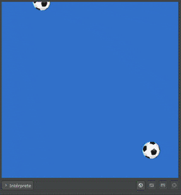

Una utilidad muy utilizada en los juegos son las funciones para obtener
números aleatorios. Pilas incluye una función muy simple para esto llamada
`pilas.azar`:

La función `pilas.azar` retorna un número aleatorio entre dos números. Por
ejemplo, si buscas que pilas retorne un número al hacer entre 1 y 5 podrías
llamar a la función así:

```typescript
pilas.azar(1, 5);
```

Es importante mencionar que el rango de valores incluye los extremos. En el
caso anterior la función podría retorna 1, 2, 3, 4 o 5.

## Un ejemplo simple

La función `pilas.azar` se podría utilizar para definir la posición inicial
de un actor de modo tal que sea impredecible para el usuario.

Por ejemplo, imagina que queremos crear actores de tipo `Pelota` que caigan
desde la parte superior de la pantalla así:



Para esto podemos crear los actores desde la función `cada_segundo` de la
escena. Y a su vez, a cada actor que creamos deberíamos asignarle una posición
`x` aleatoria así:

```typescript
class escena1 extends Escena {
  iniciar() {}

  actualizar() {}

  cada_segundo() {
    let pelota = this.pilas.actores.pelota();
    pelota.y = 250;
    pelota.x = this.pilas.azar(-200, 200);
  }
}
```
