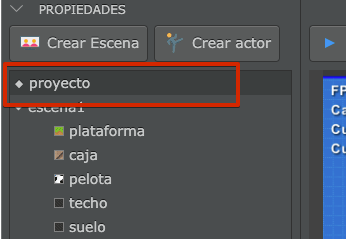
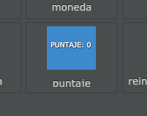
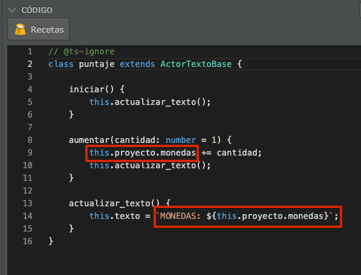
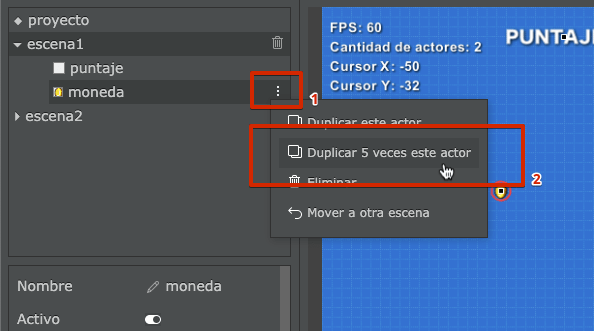
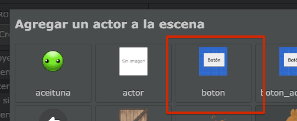

En un proyecto de pilas hay varios elementos que pueden
contener su propio código: Tanto las escenas como los actores
tienen su propio código asociado.

Ahora bien, en alguna situaciones necesitamos poder guardar
variables en algún lugar común que sobreviva más allá de los
actores y la escena actual. Por ejemplo si queremos almacenar
la cantidad de vidas disponibles que tiene un actor cuando
pasa de una escena a otra.

## Un ejemplo breve

Para ejemplificar cómo podemos usar el código de la escena
voy a dar un ejemplo. Imagina que tenemos un juego en el que
tenemos que recolectar monedas con el mouse, pero queremos
que la cantidad de monedas persista entre un nivel y otro.

Primero tenemos que seleccionar el proyecto desde el panel
de propiedades:



Luego, vamos a ver que en el panel de código aparece el
código del proyecto:


El código está casi vacío, así que vamos a crear el contador
de monedas recolectadas y vamos a darle un valor inicial:

```typescript
class Proyecto {
  monedas: number;

  iniciar() {
    this.monedas = 0;
  }
}
```

Ahora vamos a crear un actor para "visualizar" ese contador
directamente en pantalla.

Pulsá el botón "Crear actor" y luego seleccioná al actor "puntaje":



Ahora editemos el código para que este actor pueda acceder a
la variable puntaje del proyecto. Tenemos que cambiar estas lineas
de código:



Observá que desde un actor podemos acceder directamente al proyecto
usando el código `this.proyecto`, y por supuesto vamos a poder
acceder a todas las variables o métodos del proyecto directamente.

El código completo debería quedarte así:

```typescript
// @ts-ignore
class puntaje extends ActorTextoBase {
  iniciar() {
    this.actualizar_texto();
  }

  aumentar(cantidad: number = 1) {
    this.proyecto.monedas += cantidad;
    this.actualizar_texto();
  }

  actualizar_texto() {
    this.texto = `MONEDAS: ${this.proyecto.monedas}`;
  }
}
```

y una vez que ejecutamos el juego debería verse así:


Ahora creá un actor de tipo moneda, con este código:

```typescript
// @ts-ignore
class moneda extends Actor {
  cuando_hace_click() {
    this.proyecto.monedas += 1;
    this.eliminar();
  }
}
```

y luego duplica ese actor unas 5 veces desde el menú:



Y ya casi lo tenemos listo, si ejecutas el proyecto vas a ver
cómo el contador de monedas almacena y muestra la variable
`monedas` directamente desde el proyecto:


Ahora bien, lo más interesante de almacenar variables en el
proyecto es que conservarán su valor incluso si cambiamos
de una escena a otra.

Hagamos la prueba: pulsa el botón "crear escena" y en el código
de la escena coloca este código para que el usuario pueda
ver el puntaje cuando ingresa a esta escena:

```typescript
class escena2 extends Escena {
  iniciar() {
    this.pilas.clonar("puntaje");
  }
}
```

y luego, en la escena principal, pulsa el botón "crear actor" para
crear un actor de tipo "botón":



y por último, cambia el código de este actor para que nos permita
pasar a la siguiente escena cuando se pulsa:

```typescript
// @ts-ignore
class boton extends ActorTextoBase {
  cuando_hace_click() {
    this.pilas.cambiar_escena("escena2");
  }
}
```

Si bien este ejemplo es muy simple, es un punto de partida para poder
mantener los datos del jugador durante toda su partida.

Te recomiendo mirar el proyecto "mantener-valores-entre-escenas" de la
sección "ejemplos" de pilas para que veas cómo se puede mejorar este
mismo proyecto que realizamos acá.
