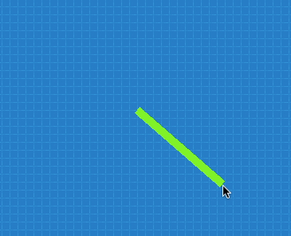

En esta sección veremos como dibujar libremente, ya sean lineas, círculos, etc..

Comenzaremos con una forma de dibujado muy sencilla, existe un actor llamado
Pizarra que podemos colocar en una escena para dibujar figuras geométricas
sencillas.

Cuando se agrega el actor pizarra, vas a observar que soporta algunos
métodos para dibujar. Esta es una lista de los más utilizados:

## Dibujar círculos

Para dibujar círculos tenemos una función que pinta el contenido de un círculo en base a 4 parámetros:

- x: la posición horizontal del centro del círculo.
- y: la posición vertical del centro del círculo.
- radio: el radio del círculo.
- color: el color de relleno que tendrá el círculo.

Por ejemplo, esta llamada a la función generará
un círculo en la posición `x=100 y=0` con un radio de 40 píxeles y de color rojo:

```typescript
this.dibujar_circulo(100, 0, 40, "rojo");
```


Opcionalmente, si quieres dibujar el contorno del círculo de otro color o con un grosor en particular podrías llamar a esta función:

```typescript
this.dibujar_borde_de_circulo(100, 0, 40, "negro", 2);
```


Los primeros 3 parámetros son idénticos al de la función anterior, corresponden a los parámetros `x`, `y` y `radio`, mientras que el argumento que le sigue será el color del borde y el último el grosor en píxeles.

## Colores

En los ejemplos anteriores utilicé colores como "rojo", "negro" y "verde"; sin embargo esta no es
la única forma de especificar colores. Los nombres de colores
son útiles y fáciles de recordar, pero no ofrecen mucha variedad.

Otra forma de definir colores con mucha flexibilidad es mediante la función `pilas.colores.generar`. Esta función genera un color "mezclando" tres componentes de color (rojo, verde y azúl).

Cada componente de color tienen que ser un número entre 0 y 255, por ejemplo:

```typescript
let color_verde_oscuro = this.pilas.colores.generar(0, 100, 0);
let color_verde_claro = this.pilas.colores.generar(0, 200, 0);
```

A su vez, una vez que tenemos el color generado, podemos usarlo
en las funciones para dibujar. Por ejemplo, si queremos dibujar
dos círculos con estos colores podemos escribir lo siguiente:

```typescript
this.dibujar_circulo(-50, 50, 40, color_verde_claro);
this.dibujar_circulo(+50, 50, 40, color_verde_oscuro);
```


## Rectángulos

De forma similar a los círculos, también existen funciones para dibujar rectángulos y bordes de rectángulos.

```typescript
this.dibujar_rectangulo(0, 0, 120, 50, "naranja");
this.dibujar_borde_de_rectangulo(0, 0, 120, 50, "rojo", 5);
```


Los argumentos de estas funciones son: el punto de originen, en este caso `x=0 y=0`, luego el ancho y alto del rectángulo y por último el color.

## Lineas

Para dibujar lineas, tenemos que especificar dos coordenadas, color y grosor de la linea:

Por ejemplo, para dibujar una linea de color "verde" desde el punto (0, 0) al punto (200, 100) podemos escribir:

```typescript
this.dibujar_linea(0, 0, 200, 100, "verde", 10);
```


## Animaciones

Si bien el actor pizarra pude moverse en pantalla, tener una figura física e incluso ser utilizado como cualquier otro actor. También es posible usarlo para crear animaciones cuadro a cuadro.

El actor Pizarra incluye una función llamada `limpiar` que si se combina con funciones de dibujado se pueden hacer algunas animaciones simples.

Por ejemplo, si queremos dibujar una linea que señale la posición del mouse constántemente podemos hacerlo así, usando la función actualizar:

```typescript
actualizar() {
    this.limpiar();
    this.dibujar_linea(0, 0, this.pilas.cursor_x, this.pilas.cursor_y, "verde", 10);
}
```


