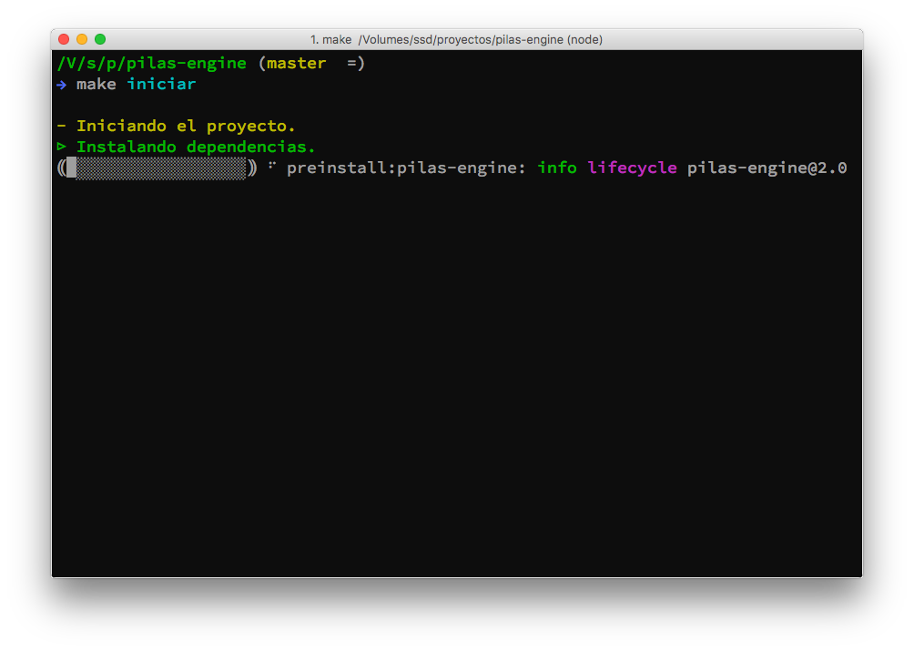
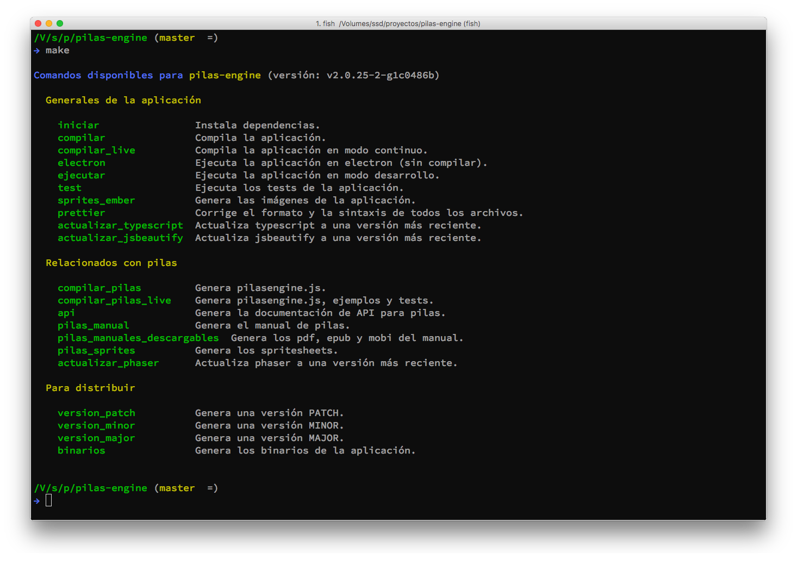
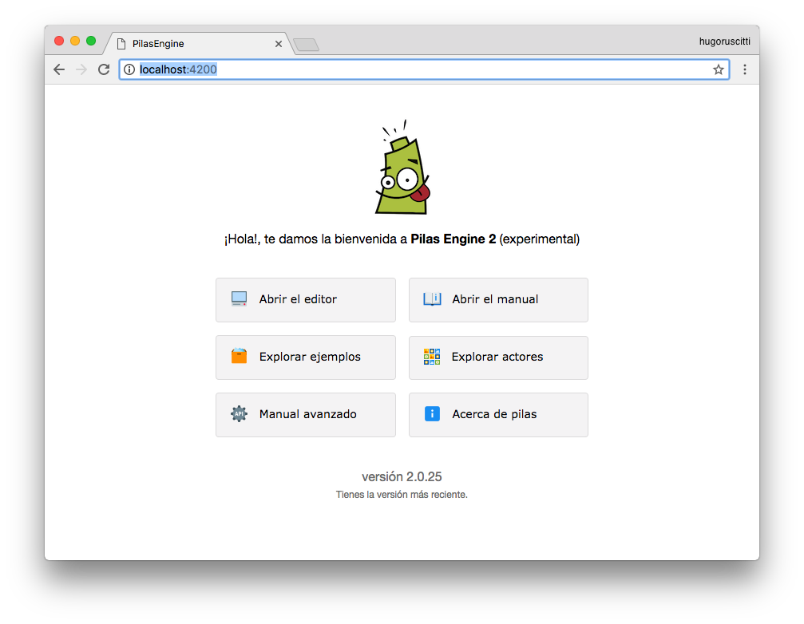
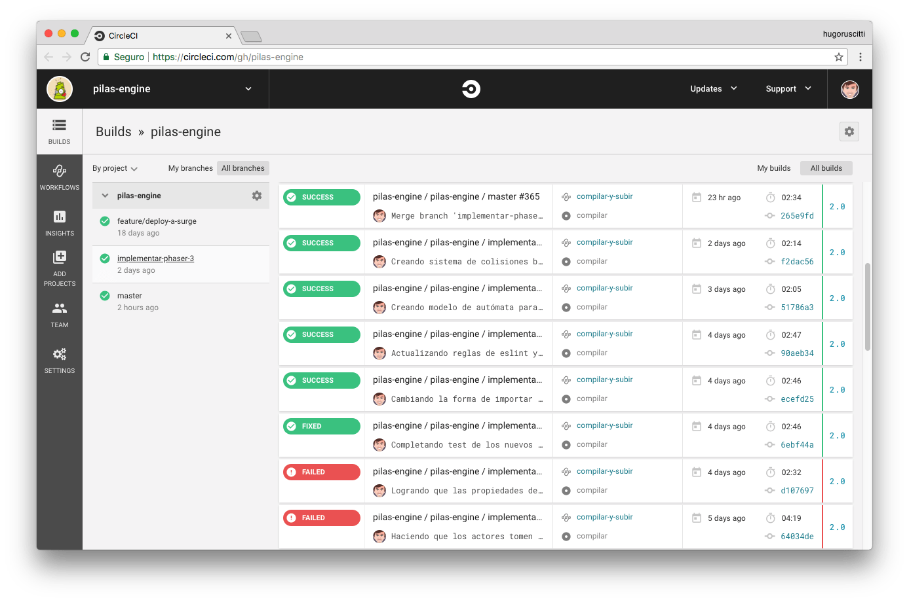
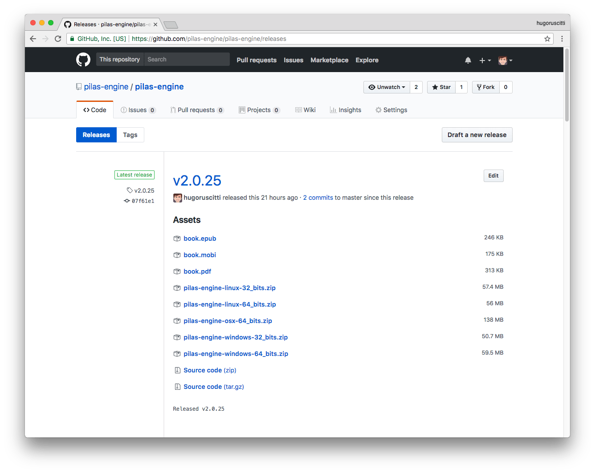

# Entorno para colaboradores de Pilas

Si sos desarrollador y queres replicar el entorno completo para editar el código de Pilas te recomendamos una serie de pasos para tener un entorno completo de desarrollo.

Ten en cuenta que si bien esta es una sección muy avanzada del manual de Pilas, cualquier duda que te surja al respecto podes realizarla en el foro de Pilas (http://foro.pilas-engine.com.ar/) para que podemos mejorar el manual.

## ¿Qué software se utiliza internamente en Pilas?

Para realizar Pilas usamos principalmente Javascript junto a varios Frameworks y utilidades. Las más importantes son:

- **Phaser**: Es la biblioteca multimedia que utilizamos para dibujar el espacio de juego de pilas, Phaser nos permite cargar imágenes, dibujarlas en pantalla, reproducir sonidos, detectar colisiones, realizar simulaciones físicas etc…
- **ember-js**: Es el framework web que utilizamos para crear la estructura visual y de interacción de la aplicación; incluye componentes, rutas, controladores y complementos. Ember también nos permite empaquetar toda la aplicación y publicarla en la web.
- **Typescript**: Lo utilizamos para el código fuente del motor Pilas. El motor de Pilas es el encargado de declarar todos los actores existentes, es donde vive la estructura de escenas, y donde se encapsulan todas las llamadas a Phaser.
- **gitbook**: Es la herramienta que usamos para componer el manual de pilas. Básicamente gittbok convierte archivos markdown en archivos .html que se pueden abrir desde la aplicación y la web.
- **electron**: Sirve para empaquetar la aplicación web completa y distribuirla en formato binario, como un ejecutable que se puede usar de forma offline.

### Estructura de directorios

Estos son los archivos principales del repositorio y qué función cumplen:

| Directorio       | ¿Qué función cumple?                                         |
| ---------------- | ------------------------------------------------------------ |
| api_docs         | Almacena el resultado de la documentación automática. Si ejecutás "make api" vas a ver cómo se recorre el código de Pilas y se genera esta documentación. |
| **app**          | Es un directorio importante, aquí está todo el código fuente de la aplicación realizado con Ember. Dentro están las plantillas, los controladores, componentes y rutas. Más adelante en este tutorial damos detalles sobre cómo editar los archivos de este directorio. Pero a grandes razgos, con "make ejecutar" o "make compilar" se puede invocar a Ember para que convierta todo ese directorio en una aplicación web. |
| **manual**       | Contiene todo el manual de Pilas en formato markdown. Podes editar el contenido con cualquier editor de textos, y para convertirlo en html y que se vea dentro de la aplicación deberías ejecutar el comando "make pilas_manual". |
| **pilas-engine** | Contiene el código fuente del motor de pilas. El código está diseñado usando typescript, por ese motivo para compilarlo hay que ejecutar el comando "make compilar_pilas" o "make compilar_pilas_live" para hacerlo de forma continua. |
| **public**       | Almacena todos los archivos que se deben servir desde la aplicación emberjs sin procesar. Por ejemplo imágenes, fuentes y sonidos. Pero además, este directorio también se actualiza desde otros comandos. Por ejemplo, cuando compilamos el código del directorio *pilas-engine* con el comando "make compilar_pilas", el archivo generado se copia a este directorio "public". |
| **tests**        | Almacena todos los tests de unidad, integración y aceptación. Estos tests se ejecutan cuando se invoca el comando "make test" o cuando se ejecuta "make ejecutar" y luego se ingresa a http://localhost:4200/tests. Además, se ejecutan en remoto cada vez que se hace un push al repositorio. Más adelante en este documento se describe cómo funcionan los tests en la estructura del proyecto. |

## Repositorio y modelo de trabajo

Antes de iniciar, necesitas tener instalado NodeJS 8 y el gestor de paquetes "yarn".

Si quieres asegurarte de tener todo correctamente instalado escribí los siguientes comandos:

```
npm install -g yarn
node -v
```

El código completo de Pilas está almacenado en Github dentro del siguiente repositorio:

- https://github.com/pilas-engine/pilas-engine

Te recomendamos iniciar un fork del repositorio antes de continuar, hay instrucciones sobre cómo realizar un fork del repositorio aquí: https://help.github.com/articles/fork-a-repo/

Una vez que tengas realizado el fork, cloná el repositorio con estos comandos e instalá las dependencias del proyecto:

```
make iniciar
```

Deberías ver cómo se van instalando todas las dependencias dentro del directorio "node_modules". Esto puede demorar varios minutos:



Una vez finalizada la instalación de dependencias podes ejecutar el comando "make". Cuando lo escribas, van a aparecer en pantalla todos los atajos que usamos dentro del proyecto:



Obviamente en la mayoría de los casos usamos solo algunos comandos, pero siempre vamos a mantener actualizado este listado para simplificar el desarrollo.

Para poner en funcionamiento el servidor de Ember podes ejecutar este comando:

```
make ejecutar
```

y luego abrí esta dirección en el navegador: http://localhost:4200



Ten en cuenta que el servidor de Ember va a estar en ejecución; cada vez que modifiques un archivo del código de la aplicación Ember se va a encargar de actualizar el navegador automáticamente.


## Estilo de programación

Te recomendamos escribir el código en español siempre que sea posible, y aquellas variables o métodos que tienen varias palabras intentaremos escribirlas como "nombre_del_metodo" en lugar de "nombreDelMetodo".

Además, es muy importante que tengas configurado tu editor para usar automáticamente prettier (<https://prettier.io/>).


## Tests

El proyecto incluye tests que intentamos llevar de la mano con cada característica que agregamos a la herramienta. Los tests se almacenan en el directorio "tests" y cada uno de ellos está diseñado para encargarse del funcionamiento de una característica de la herramienta.

Por ejemplo, el archivo `tests/acceptance/puede-ingresar-al-editor-test.js` se encarga de simular el comportamiento de un usuario que ingresa en la aplicación y comienza a interactuar con la interfaz.

Cada sentencia del archivo intenta simular una acción del usuario y viene acompañada de alguna validación:


De esta forma, tenemos la seguridad de que podemos validar el funcionamiento de toda la herramienta de forma automatizada. Nos permite detectar errores y darnos confianza para re-estructurar o mejorar partes internas de la aplicación sabiendo qué funcionalidad podría comprometer.

Si ejecutas el comando "make ejecutar", y abrís la aplicación con un navegador desde "http://localhost:4200", también vas a poder ejecutar los tests directamente en el navegador.

Tendrías que ingresar a la dirección "http://localhost:4200/tests":


En la imagen marqué dos opciones que me parecen útiles para todas las personas, la primera evita que la pantalla se llene con detalles de tests que corren bien y la segunda es simplemente estética: sirve para ver cómo se ven los tests visualmente al costado de la pantalla.


## Automatización e integración contínua

Hay varias tareas que se realizan de forma automática cada vez que realizamos un push al repositorio.

Por ejemplo, cada vez que se ejecuta un push sobre github, un servicio llamado "circle-ci" se encarga de correr todos los tests del proyecto desde cero.

Este servicio no solo ejecuta los tests, sino que nos avisa por email si alguna de las pruebas falló o si alguna fase de la instalación tuvo problemas. Además nos genera un listado histórico para corroborar si un cambio introduce algún tipo de error:



También usamos "circle-ci" cada vez que hacemos un lanzamiento estable de la herramienta para que se generen los binarios y las versiones web de la aplicación.

La forma que utilizamos para marcar que Pilas se puede publicar es realizando un tag. Los tags los va a detectar circle CI para generar binarios y subir una versión actualizada de la aplicación a la web.

Por ejemplo, en la imagen se ve el tag de la versión v2.0.25. Cuando eso sucedió, "circle-ci" generó estos archivos para que esa versión de pilas esté compilada y disponible para descargar desde aquí:



Si bien estos pasos son automáticos, todo el detalle de lo que se debe ejecutar está en el archivo  `.circleci/config.yml`.