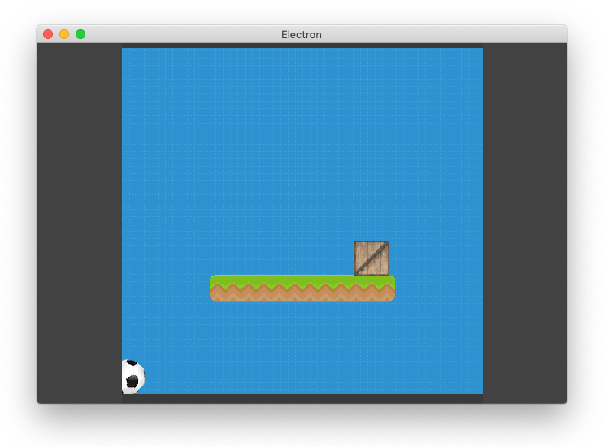
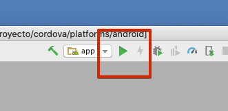

El editor de pilas incluye la posibilidad de exportar proyectos completos para ser utilizados sin el editor.

Para exportar un juego simplemente hay que pulsar el botón Exportar del editor:


A continuación se nos va a mostrar una pantalla de exportación, que demora unos minutos ya que tiene que recopilar todos los recursos necesarios, y luego obtendremos un archivo comprimido con el proyecto:


Este archivo .zip aloja el proyecto completo, así que podemos utilizarlo para punto de partida para llevar nuestro juego a otro lugar.

A continuación se muestran algunas alternativas de publicación:

### ¿Qué contiene el archivo exportado?

El archivo .zip se puede descomprimir fácilmente con las herramientas que vienen instaladas en cualquier sistema operativo.

Una vez que se descomprime, vamos a observar un archivo de ayuda y una carpeta llamada "proyecto" con todos los recursos de nuestro juego:


### Cómo ejecutar mi juego sin el editor

El primer paso es tener instalado [Node.JS](https://nodejs.org/es/) y acceso a un terminal para ejecutar comandos.

Luego, se tiene que ingresar en el directorio "proyecto" y ejecutar el comando:

```typescript
npm install
```

Si todo va bien, deberíamos ver que el instalador de paquetes de node trabaja unos segundos para descargar todo lo necesario para seguir trabajando:


A partir de este punto, vas a tener la posiblidad de hacer alguna de estas cosas:

### Probar la aplicación en un servidor local

Para iniciar el juego directamente en un navegador podrías escribir este comando en el mismo directorio "proyecto":

```
npm start
```

A continuación se va a abrir el navegador y tu juego.


Ten en cuenta que pilas no funciona directamente abriendo el archivo index.html en un navegador, la razón por la que no puede andar directamente es porque necesita cargar archivos mientras se inicializa usando ajax (algo que los navegadores no pueden hacer si se inicializan abriendo un archivo .html de forma directa).

### Ejecutar tu juego en electron de forma offline

Otra opción es lanzar el juego como si se tratara de una aplicación dedicada, sin necesidad de un navegador.

Para eso, tendrías que ejecutar este comando:

```
npm run electron
```



### Cómo crear versiones empaquetas para distribuir (.exe, dmg etc)

Una opción muy solicitada a la hora de exportar juegos es poder hacerlos completamente portables, y que la persona que recibe el juego no tenga que instalar o configurar nada para jugar al juego, solamente hacer "doble click" en un archivo y jugar.

Pilas permite hacer esto mediante la herramienta que mencionamos antes llamada electron y una serie de scripts.

Tomemos el ejemplo más solicitado, hagamos que nuestro juego se pueda compilar para windows y distribuirse como un archivo .exe. Lo que tenemos que hacer es hacer doble click en los archivos:

- instalar_dependencias.bat
- generar_version_exe.bat

o bien, abrir el comando "cmd", ingresar en el directorio del juego
exportado y ejecutar estos comandos:

```
npm install electron-packager --save-dev

node_modules/.bin/electron-packager . mijuego --platform=win32 --arch=ia32
```

El comando demorará unos segundos, cuando termine aparecerá un mensaje indicando que los archivos están listos:


En mi caso, los archivos se generaron en un directorio llamado "mijuego-win32-ia32". Ese directorio completo es el que se puede entregar a los usuarios de windows para que puedan ejecutar el juego haciendo doble click en el archivo .exe:


Si además de windows estás buscando llevar tu juego a otras plataformas como gnu/linux, mac/osx o raspberry también hay un parámetro para lanzar la compilación en todas las plataformas soportadas así:

```
node_modules/.bin/electron-packager . mijuego --all
```

Hay varios parámetros más, pero para no extendernos mucho te dejamos la [documentación detallada de electron-packager](https://github.com/electron-userland/electron-packager#usage)

Por cierto, si quieres investigar exactamente qué hacen estos scripts podrías profundizar tu investigación mirando la [documentación de electron sobre distribución de binarios](https://electronjs.org/docs/tutorial/application-distribution) ya que se describe cada uno de los pasos de compilación de forma manual.

### Cómo ejecutar el juego en pantalla completa

Si empaquetas el juego con electron, como muestra la sección anterior, también
tienes la posibilidad de configurar la compilación para que funcione en modo
pantalla completa. Para eso tienes que editar el archivo `index.js` y colocar
`true` en la variable `pantalla_completa`:


### Cómo llevar mi juego a celulares, tablets y tiendas oficiales de apple o google

Pilas incluye una forma sencilla de probar juegos en celulares y tablets, si solo quieres probar tus juegos te recomendamos mirar ahí primero.

Ahora bien, si en realidad lo que buscas es llevar tu juego de forma permanente a un celular o tablet, ya sea para tí, amigos o para publicar en un tienda oficial, lo que necesitas es instalar cordova, los SDK oficiales para tu tipo de dispositivo (android o ios) y compilar tu juego por completo.

```
npm install cordova -g

cordova create cordova
```

Luego, tendrías que mover todos los archivos del directorio "proyecto" (index.html, pilas-engine.js etc…) dentro del directorio "cordova/www".

Por último, tendrías que agregar la plataforma principal (android o ios) y luego iniciar la compilación:

Por ejemplo, para ios:

```
cd cordova
cordova platform add ios
cordova build ios

```

y luego abrir el proyecto desde el directorio "platforms/ios" en xcode y ejecutar:


Y para android:

```
cd cordova
cordova platform add android
```

En este punto, asegúrate de haber movido todos los archivos del directorio "proyecto" (index.html, pilas-engine.js etc…) dentro del directorio "cordova/www".

Luego tienes que generar el proyecto para android con este comando:

```
cordova build android
```

y luego abrir el proyecto del directorio "platforms/android" con Android Studio y pulsar el botón ejecutar para lanzar el emulador:



O bien, abrí el menú "Build" y luego "Build APK(s)" o "Generate Signed APK" para crear el un archivo `.apk` e instalarlo directamente en tu equipo o subirlo a la tienda Play Store de Google.
