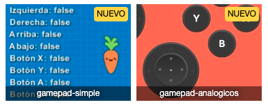

Pilas permite acceder a controles externos tipo gamepad para que puedas hacer juegos mucho más interactivos y fáciles de jugar.

Cada vez que conectes un gamepad pilas lo reconocerá y creará un objeto interno para que puedas acceder a cada uno de los botones y controles del gamepad.

## Tipos de gamepad soportados

Pilas interactúa con algunas funciones públicas de los navegadores para acceder a los gamepad, así que no soporta todo tipo de controles.

Los gamepads que probamos y pudimos ver funcionando son los siguientes:

- gamepad xbox360 sobre windows 10 (tanto cableado usb y como mediante un receptor inalámbrico usb).
- pro controller de nintendo switch (bluetooth).
- joy-con de nintendo switch (bluetooth).

Cómo verás la lista no es muy larga, muchos gamepads genéricos no funcionan con navegadores modernos, y otros gamepads modernos como los de PS4 aún no llegamos a probarlos (pero creemos que podrían funcionar).

Así que te recomendamos realizar una prueba antes de comenzar a programar: ejecuta alguno de los ejemplos diseñados para probar gamepads y corrobora si tu gamepad funciona correctamente dentro de pilas.

Los ejemplos que te recomendados visitar son "gamepad-simple" y "gamepad-analógicos": 



## Acceder a los controles

Para controlar un actor mediante un gamepad no hay que hacer nada especial, si pilas detecta un gamepad conectado va a permitirte acceder a él mediante los atributos:

```
this.control.izquierda
this.control.derecha
this.control.arriba
this.control.abajo
etc...
```

Estos atributos son muy convenientes, porque el jugador va a poder controlar al personaje usando un gamepad o el teclado.

Estos atributos se pueden consultar desde el código de un actor así (ten en cuenta escribir este código dentro de la función `actualizar`):

```typescript
if (this.control.izquierda) {
  this.x -= 5;
}

if (this.control.arriba) {
  this.y += 5;
}

// etc.
```

Sin embargo, puede suceder que quieras acceder a todas las funcionalidad de un gamepad, como el hecho de que tienen dos controles analógicos o varios botones. En ese caso, deberías acceder a los controles mediante la variable `this.pilas.control.pad_1`.

Por ejemplo, para mover un personaje de forma gradual usando el analógico izquierdo deberías usar un código como este:

```typescript
this.x += this.control.gamepad_1.analogico_izquierdo_x * 10;
this.y += this.control.gamepad_1.analogico_izquierdo_y * 10;
```

Aquí no hace falta usar una condición de tipo `if`, porque el atributo `analogico_izquierdo_x` y `analogico_izquierdo_y` nos devolverá un número entre `-1` y `1` si el control se está moviendo en alguna dirección o simplemente `0` si está en reposo.

Para el analógico derecho también existe un atributo llamado `analogico_derecho_x` y `analogico_derecho_y`.

Luego el acceso a los botones se realiza mediante los atributos comenzados con el prefijo `boton_`, por ejemplo estos:


Esta imagen resume varios los controles más importantes:


Sin embargo te recomendados ver el autocompletado código directamente en el editor porque hay muchos más atributos para explorar ahí.