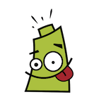

{width=128px height=128px}

Pilas Engine es una herramienta que te permite crear tus propios videojuegos y aprender a programar. Está diseñada por desarrolladores de habla hispana y cuenta con el respaldo de docentes y profesionales especialistas en desarrollo de Software.

## Índice de contenido

- [Primeros pasos](primeros_pasos.html)
- [Actores](actores.html)
- [Escenas](escenas.html)
- [El intérprete](interprete.html)
- [Animaciones](animaciones.html)
- [Animación de propiedades](animacion_de_propiedades.html)
- [Músicas y sonidos](musicas-y-sonidos.html)
- [Recorridos](recorridos.html)
- [Cámara](camara.html)
- [Autómatas y estados](automatas_y_estados.html)
- [Etiquetas](etiquetas.html)
- [Habilidades](habilidades.html)
- [Comportamientos](comportamientos.html)
- [Mapas](mapas.html)
- [Azar o cálculos aleatorios](azar.html)
- [Observables](observables.html)
- [Manejo de tiempo](tiempo.html)
- [Angulos y distancias](angulos-distancias.html)
- [Colisiones](colisiones.html)
- [Sensores](sensores.html)
- [Lasers](lasers.html)
- [Mensajes](mensajes.html)
- [Código de proyecto](codigo-de-proyecto.html)
- [Eventos de mouse o touch](eventos-de-mouse.html)
- [Consejos para usar el editor](editor-de-codigo.html)
- [Uso del teclado](uso-del-teclado.html)
- [Controles Gamepad](gamepad.html)
- [Dibujado simple en pantalla](dibujado_en_pantalla.html)

Sección avanzada

- [Cómo exportar juegos a .exe, web, mobile etc...](exportar_juegos.html)
- [Colaborar con pilas](colaborar.html)
- [Pilas como biblioteca](pilas_como_biblioteca.html)
- [Entorno para colaboradores de Pilas](entorno.html)
