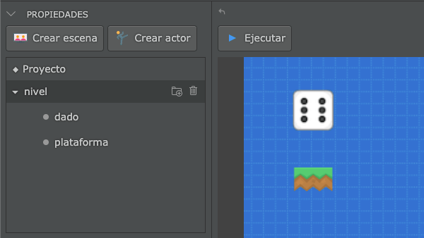
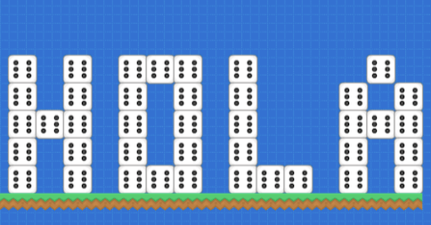

Los escenarios de muchos videojuegos se construyen utilizando una técnica
llamada tiles, que consiste en utilizar pequeños bloques llamados "tiles" para
crear niveles grandes.

Por ejemplo, en esta imagen se puede ver un nivel diseñado usando esta técnica:


Esta técnica es muy útil porque permite crear escenarios de manera sencilla.
Simplemente repitiendo bloques y reutilizando actores.

Pilas incluye dos funciones para que podamos hacer niveles de esta forma. Por
un lado tenemos una función para definir los bloques que vamos a utilizar y
luego una función para dibujar el escenario en pantalla.

## Cómo dibujar un mapa en pantalla

El primer paso es definir qué actores vamos a utilizar como
bloques, tenemos que tener esos actores en cualquiera
de las escenas.

Por ejemplo, aquí tengo dos actores, uno llamado "dado"
y el otro "plataforma":



Si quiero crear un nivel usando estos actores
tengo que indicarle a pilas cómo llamar a estos actores
en la definición de un mapa:

```typescript

this.pilas.definir_mapa({
  "d": "dado",
  "p": "plataforma"
});
```

De esta forma, pilas sabrá que cada que vez que usemos
la letra `d` en un mapa nos estaremos refiriendo a un dado
y cada vez que usemos la letra `p` estaremos refiriéndonos
a una plataforma.

Ahora, imagina que queremos dibujar el mensaje "HOLA"
usando dados y luego poner una plataforma debajo del mensaje
así:



Para esto podemos usar la función `pilas.crear_mapa` y
las teclas `d` y `p` que definimos antes así:

```typescript
this.pilas.crear_mapa(`
      d.d.ddd.d....d.
      d.d.d.d.d...d.d
      ddd.d.d.d...ddd
      d.d.d.d.d...d.d
      d.d.ddd.ddd.d.d
      pppppppppppppppp
`, 32)
```

Oh, un pequeño consejo: suele ayudarte a leer mejor el mapa
en texto si seleccionar el caracter que estás ingresando con
el editor:


También puede ayudarte a mejorar la legibilidad si usas separadores
como ".", "-" o espacios en aquellos lugares donde no necesitas
dibujar un actor.

