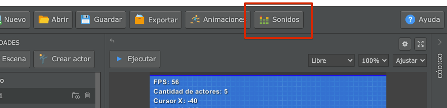
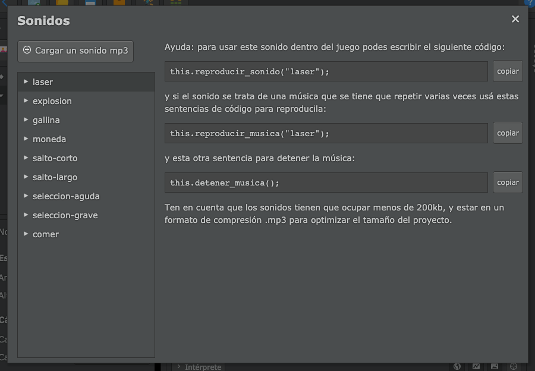

La música y el sonido de un videojuego es clave para lograr que el juego sea divertido y genere reacción en las personas que lo juegan, por ese motivo pilas también incluye un gestor de sonidos incluir audio en tus videojuegos.

Para gestionar los sonidos del proyecto tienes que pulsar el botón "Sonidos" de la interfaz:



Luego vas a ver una ventana con varios sonidos pre cargados, la posibilidad de subir sonidos personalizados y algunos códigos de ejemplo para reproducir estos sonidos desde el código:



## Cómo reproducir sonidos desde el código

Cada sonido tiene su propio nombre dentro del gestor de sonidos. Este nombre es super importante porque es el que nos va a permitir distinguir los diferentes sonidos, o músicas, que incluye el juego.

## ¿Qué diferencia la música de los sonidos?

Tal vez habrás notado que para pilas la música y los sonidos se cargan como archivos `.mp3` en la misma ventana, y de hecho comparten el mismo listado.

Sin embargo hay una diferencia cómo pilas gestionan c estos dos tipos de archivos de audio:

- La música se puede reproducir una a la vez. Y cuando el audio de la música finaliza vuelve a comenzar. Esto es ideal para músicas estilo "loop", que se pueden repetir todo el tiempo.
- Los sonidos se pueden reproducir en simultáneo, tantas veces como se quiera y junto a otros sonidos.

Ahora bien, esta distinción la tenemos que expresar en el código: cada vez que queramos reproducir una música, debemos llamar a la función:

```typescript
this.reproducir_musica(nombre);
```

lo que hará que comience a reproducirse ese audio (infinitas veces) y se detendrá cualquier otra música.

Mientras que si queremos reproducir un sonido podemos llamar a la función:

```typescript
this.reproducir_sonido(nombre);
```

