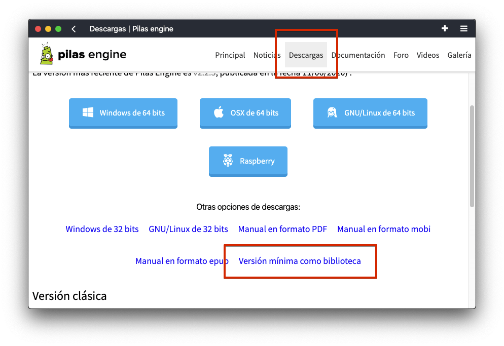
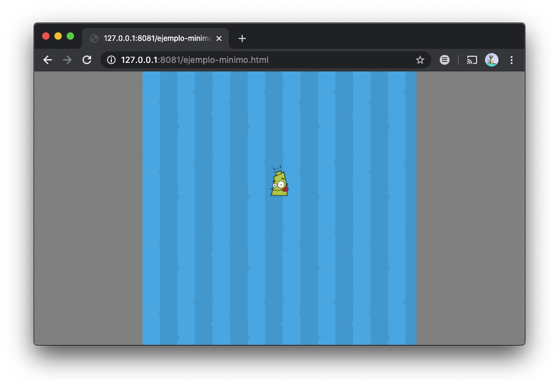

Pilas se puede usar como una biblioteca externa para permitir un uso avanzado
y muy personalizado de pilas.

De todas formas, la opción más recomendada para llevar tu juego
a blogs, mobile u otros medios es siguiendo las instrucciones
que están en esta otra sección: [Cómo exportar juegos](exportar_juegos.html)

Esta sección solo es aconsejable para programadores avanzados
que quieran integrar pilas a otras bibliotecas, como [react](https://reactjs.org/),
[vue](https://vuejs.org/) o similares, partiendo de un código minimalista, sin imágenes,
sonidos ni actores predeterminados de pilas.

## Archivos iniciales

Para utilizar pilas como biblioteca se suele crear un archivo `.html` e incorporar
las dependencias del proyecto, como `phaser` y `nine-slice`. Así que para hacer más sencilla
esta tarea inicial pilas se distribuye junto a una plantilla que tiene todos estos
archivos listos y configurados para utilizar.

Ingresá en el sitio de pilas, y en la sección descargas vas a encontrar un link para
descargar una plantilla llamada "versión-minima":



Este archivo `.zip` tiene lo mínimo y necesario para cargar pilas y poder usar el
motor directamente:

Ten en cuenta que para utilizar esta versión tienes que descomprimir el archivo
`.zip`, luego iniciar un servidor web y por último abrir el archivo `.html` desde un
navegador:



Es importante usar un servidor web y no abrir el archivo directamente ya que
pilas (y phaser) usan una tecnología llamada Ajax para cargar imágenes y otros recursos.

A partir de ahí, para editar tu juego deberías inspeccionar el archivo `.html`, en donde
aparecerá el código mínimo para iniciar pilas, crear un actor y moverlo por la pantalla:

```typescript
var imagenes = [
  {
    nombre: "logo",
    ruta: "logo.png"
  },
  {
    nombre: "fondo",
    ruta: "fondo.png"
  }
];

var pilas = pilasengine.iniciar(500, 500, recursos, opciones, imagenes, true);

pilas.onready = function() {
  let logo = pilas.actores.actor_basico("logo");
  logo.transparencia = 100;

  logo
    .animar()
    .mostrar()
    .mover_hasta(0, 50);
};
```

Por supuesto puedes cambiar ese código y adaptarlo a tus necesidades, pero no olvides
que esta versión mínima no incluye las tipografías, sonidos e imágenes que incluye pilas,
deberías cargar archivos `.png` propios para tener más posibilidades.
