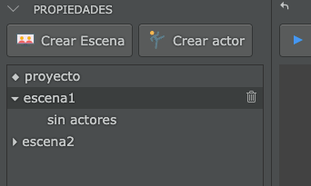
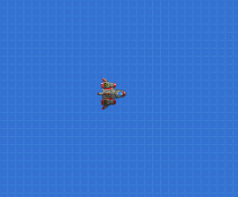
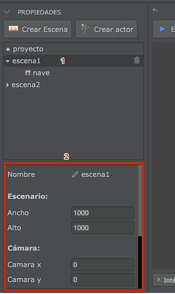
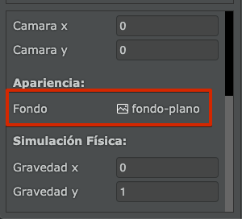
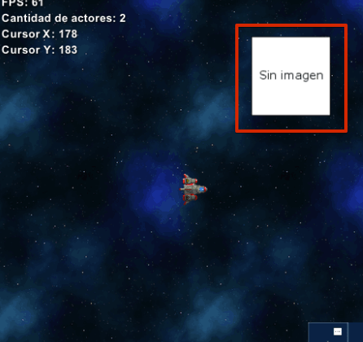
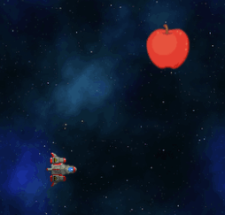
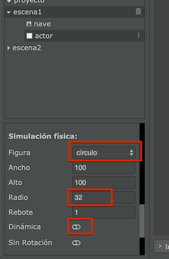
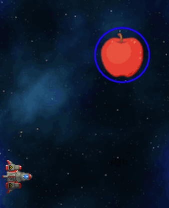
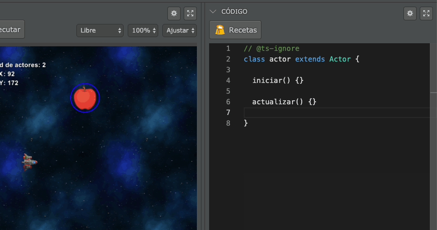

En esta sección me gustaría describir los pasos iniciales para comenzar a hacer juegos.

Pilas ha sido diseñada especialmente para que todas las personas puedan aprender a programar realizando videojuegos, de forma sencilla y totalmente en español.

Esta es la pantalla inicial que aparecerá cuando abras pilas por primera vez:

Desde aquí se pueden acceder a todas las secciones de pilas, te recomendamos inspeccionarlas al menos una vez para familiarizarte con el entorno.

Ahora bien, la parte más interesante de la herramienta se puede acceder pulsando el botón que dice "**Abrir el editor**"

Desde esta sección, vas a ver una escena principal y varios paneles:

Al principio puede parecer un poco abrumador… pero vamos a ir paso a paso. Hay dos partes importantes en esta pantalla:

- A la izquierda está el panel de actores y propiedades. Donde vamos a ver listados todos los actores que aparecen en la pantalla. Los actores en este caso son: una plataforma, una pelota, una caja, un techo y suelo.

- Luego a la derecha de la pantalla tenemos el area del editor:

  

Hay otras cosas importantes en la interface, pero vamos a prestarle mayor atención a estas dos partes.

Sigamos:

## ¡Pongamos el juego en funcionamiento!

El botón que aparece arriba del area de juego es muy importante, porque nos permite poner en funcionamiento el juego y hacer una prueba real.

Así que hagamos el intento, pulsa el botón ejecutar una vez:

Deberías ver cómo dos de los actores comienzan a rebotar en la plataforma:

Cuando pulsas el botón "ejecutar" además de ponerse en funcionamiento el juego sucede algo más: el editor por completo ingresará en un modo llamado "ejecución", así que no vamos a poder editar el código o cambiar la escena. Todo lo que suceda en ese momento es parte de la experiencia de usuario de nuestros juegos. Una vez que exportemos el juego, nuestros usuarios solo van a ver el juego, no el editor.

Esto es importante porque nos lleva a pensar en el diseño del juego y hacernos preguntas interesantes: ¿Qué queremos que el usuario haga dentro de nuestro juego?, ¿qué elementos le vamos a mostrar?, ¿cuándo gana y cuando pierde?.

Pero claro, por el momento solo podemos hacernos las preguntas, porque lo que tenemos en el editor es muy poquito, el usuario no puede hacer nada muy interesante aún… solo ver cómo rebotan esos dos objetos en la plataforma :|

## Diseñando nuestro primer juego

Para nuestro primer juego vamos a pensar en algo más interesante, queremos que el fondo del juego sea un cielo lleno de estrellas, que el usuario pueda mover una nave con el teclado y que luego de unos segundos comiencen a aparecer algunos enemigos.

Pulsá el botón que dice "detener" en el editor (o pulsá la tecla `Esc`), tendrías que volver a ver el resto de los elementos del editor nuevamente habilitados.

Borremos cada uno de los actores que aparecen en la pantalla, selecciona al actor pelota y luego pulsa el botón del cesto de basura tal y como muestra esta imagen:

Repetí esos pasos hasta que la escena quede limpia, sin ningún actor:

Ahora bien, con la escena completamente limpia, agreguemos un actor para representar a nuestro protagonista:

Pulsa el botón "Crear actor" y luego selecciona la nave:

Una vez que selecciones el actor vas a verlo formar parte de la escena así:

Ahora pulsemos de nuevo el botón "ejecutar" y pulsa las flechitas del teclado para mover la nave por el escenario (¡y con la barra espaciadora vas a poder disparar!):

## Ambientando la escena en el espacio

Al principio te mencioné que queríamos hacer que la nave pareciera estar en el espacio, sin embargo aún tenemos ese fondo azul que no se parece mucho al espacio...

Así que hagamos un cambio, selecciona la escena del panel izquierdo, vas a ver que la parte inferior del panel va a cambiar:

Esa sección que marcamos con el número "2" en la imagen contiene todas las propiedades de la escena. Si moves la barra de desplazamiento hacia abajo vas a ver una propiedad llamada fondo:

Hace click sobre esa propiedad, donde está el ícono y vas a ver que pilas te propone varias imágenes para sustituir el fondo:

Selecciona la del espacio:

Vas a notar que el fondo de la pantalla va a cambiar por completo:

## Creando más actores

Ahora vamos a darle un poco mas de vida al juego: Nuestra nave está en el espacio pero no parece haber un motivo por el cual está ahí, pensemos una historia:

"A causa de un experimento que se salió de control en la tierra, algunos objetos llegaron al espacio: bananas, manzanas y otras frutas comenzaron a ensuciar el espacio flotando por ahí. Nuestra misión es comandar una nave que tiene como objetivo "limpiar" el desorden de la basura espacial lo antes posible !!!"

Bueno, no es una gran idea... pero es algo, algo que podemos construir, jugar y divertidos. ¡así que vamos a intentarlo!

Pulsá el botón "Crear actor" nuevamente:

Pero a diferencia de antes, que elegimos la nave, ahora elegí el actor que no tiene una imagen asignada:

Luego, puedes mover este actor usando el mouse, así no tapa a la nave:

Ahora cambiemos la apariencia del actor. Este paso es muy similar al que hicimos antes, tendrías que seleccionar al actor, ir al panel de propiedades pero ahora pulsar la propiedad "imagen":

y luego, selecciona alguna de las opciones. Por ejemplo una manzana:

y te debería quedar así:

## Agregando colisiones

Vamos a hacer que la manzana se pueda destruir con los disparos de la nave.

Para eso tenemos que volver a seleccionar el actor con apariencia de manzana y asignarle una figura física así:

Estos parámetros admiten muchas combinaciones, pero te recomiendo que la figura sea "círculo", el radio de "32" y desactives la opción "Dinámica".

Vas a notar que en la pantalla aparecerá un círculo azul al rededor del actor nuevo. Esto significa que el actor tiene un area de contacto para poder interactuar con el resto de los actores:

## Reaccionando a las colisiones

Para hacer que el actor manzana reaccione tenemos que escribir un poquito de código.

Selecciona nuevamente al actor y pulsa la pestaña que aparece en la parte derecha de la pantalla que tiene el texto "Código":

Cuando pulses esa pestaña, vas a ver que se abre un panel nuevo; un panel en donde tenemos código y un botón que dice "Recetas":

El código es una de las cosas más importantes que incluye pilas, ya que el código nos permite darle órdenes a la computadora para que haga cosas, como eliminar actores, reaccionar al movimiento del mouse, emitir sonidos y todo lo que se te ocurra.

Sin embargo para empezar vamos a tomar un atajo, vamos a pedirle a pilas que nos ayude a escribir el código para que la manzana se pueda eliminar fácilmente.

Pulsa el botón que dice "Recetas":

y luego selecciona la opción que dice "Cuando colisiona explotar":

Cuando hagas eso, vas a notar que pilas escribió por nosotros una porción de código que hace algunas cosas por nosotros:

Mas adelante en el manual vamos a escribir algo de código sin usar recetas, desde cero y comprendiendo cada función y expresión, por ahora lo dejaremos ahí.

Ahora pulsa "Ejecutar" y corrobora cómo los disparos pueden limpiar el espacio de frutas:

## Es solo el principio

Pilas es una herramienta super completa, y este mini-tutorial es solo el comienzo de una gran aventura. Seguí leyendo este manual para conocer muchas más cosas que incluye pilas o explora nuestro sitio web, vas a encontrar tutoriales, videos, juegos y muchas cosas más.

¡Te damos la bienvenida a el mundo de la programación!
