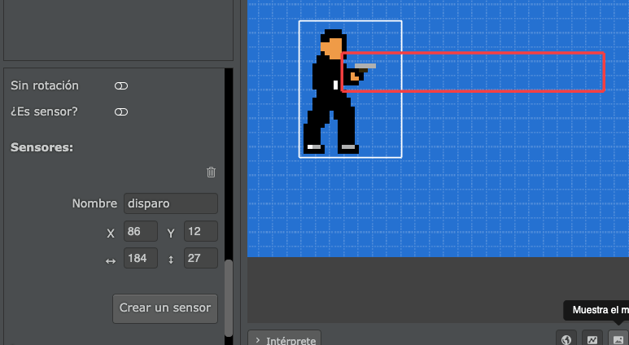
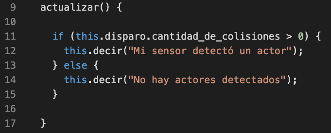

Los sensores nos permiten detectar colisiones entre un actor y otros
mediante areas rectangulares.

Se pueden utilizar en muchas situaciones diferentes, podrían ser útiles
para detectar si una puerta se tiene que abrir ante la cercanía de un
actor, detectar si un actor está pisando el suelo o saltando, hacer que un
soldado detecte a un enemigo y varias cosas más.

## Crear sensores desde el editor

El primer paso para crear un sensor es tener seleccionado un actor y luego
añadir el sensor al final de la lista de propiedades:

Una vez que pulsamos ese botón, vamos a poder cambiar las coordenadas del sensor
y ajustarlo a nuestro gusto.

En este caso, hice que el actor tenga un sensor para detectar si se encuentra
frente a algún actor:

## Acceder a los sensores desde el código

Lo interesante de los sensores es cuando podemos interactuar con ellos desde el
código, ya que desde ahí vamos a poder saber si el sensor detecta colisión con otros actores.

Tomemos como ejemplo el actor de la imagen anterior, el sensor que creamos se llama "disparo" así
que para poder consultarle cosas necesitamos vincularlo a la clase del actor así:

A partir de ese momento, vamos a poder acceder a toda la información del sensor así:

Por ejemplo, si queremos hacer que el actor nos diga en todo momento si hay algún actor
frente a su vista podemos escribir algo así:

y como resultado, tendríamos que observar algo así:

Es decir, cada vez que usemos el código `this.disparo.cantidad_de_colisiones` podremos
obtener el número de actores colisionando con ese sensor.

## Evaluando colisiones con etiquetas

Mediante código también se puede saber con qué actores entra en contacto un
sensor. Se puede utilizar la función `colisiona_con_etiqueta(etiqueta)` que retorna
`true` o `false` o incluso la función `colisiones_con_la_etiqueta(etiqueta)` que
retornará una lista de todos los actores que colisionan con el sensor.

Si quieres ver un caso más completo de esto te recomendamos ver este minijuego
dentro de la sección de ejemplos, en donde se usan sensores para detectar que
actores se pueden golpear:

